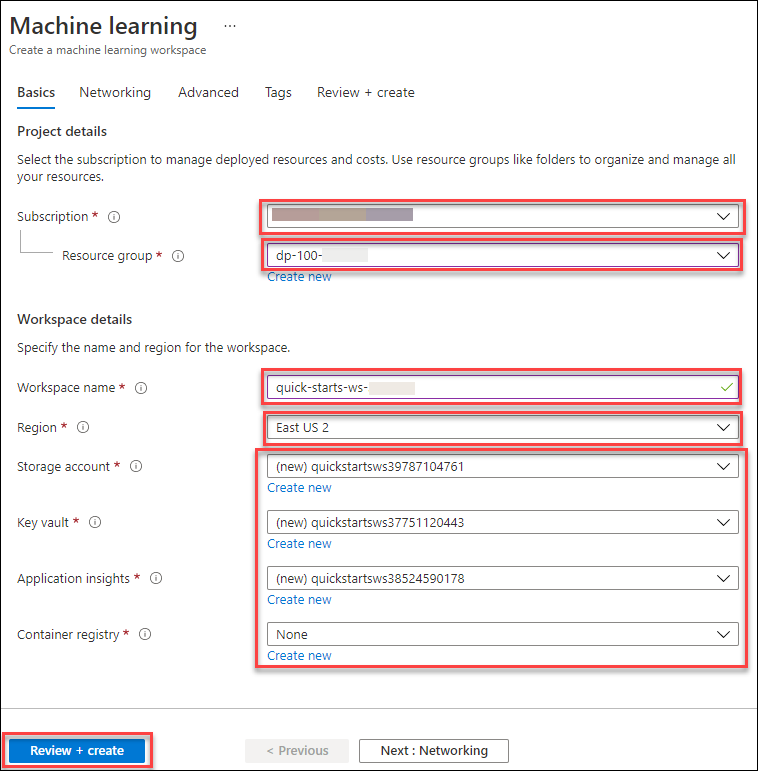
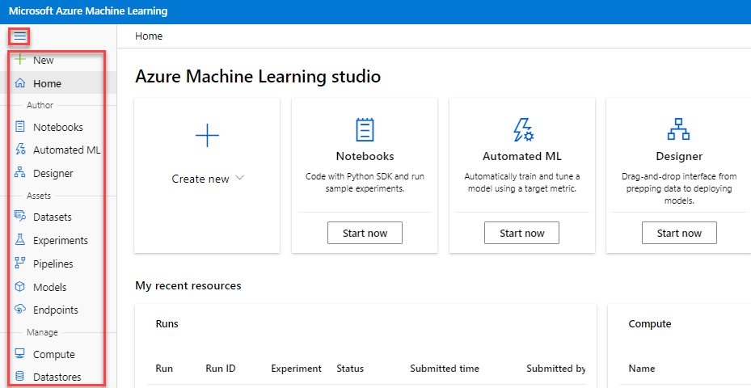
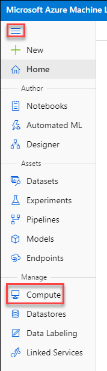
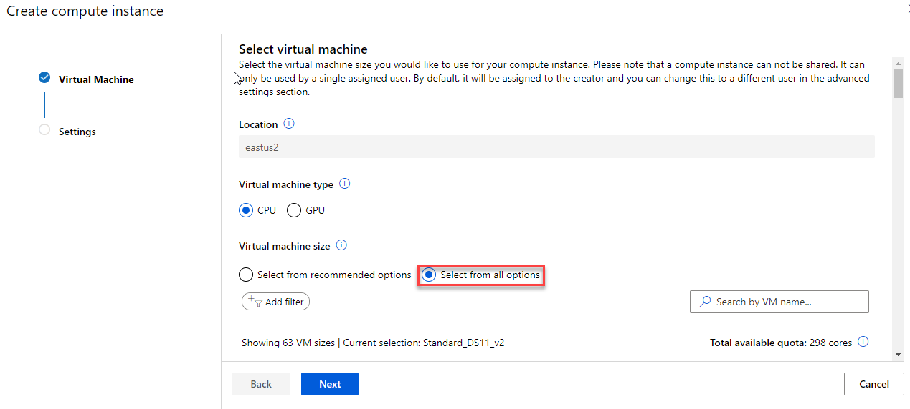
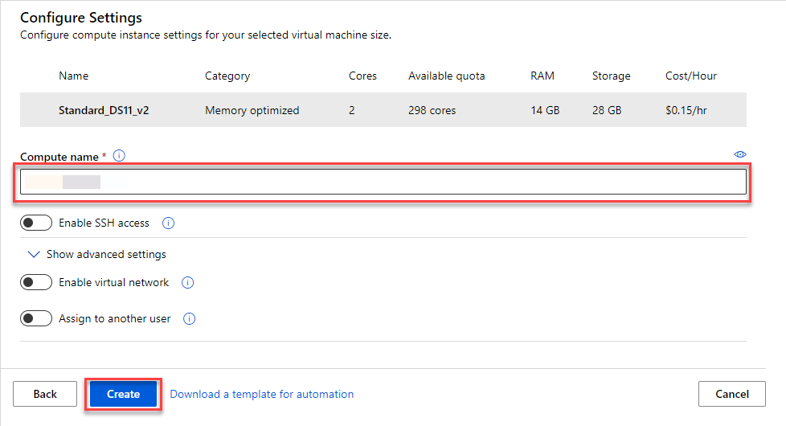
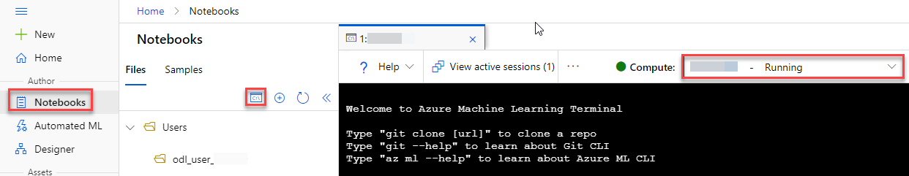
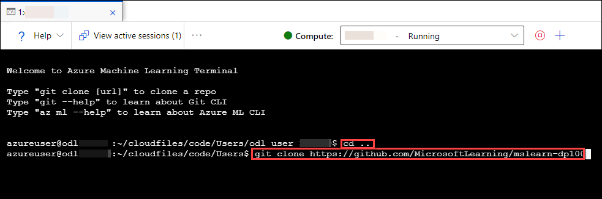
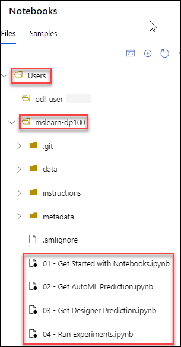

# Create and Explore an Azure Machine Learning Workspace

## Overview

In this exercise, you will create and explore an Azure Machine Learning workspace.

## Create an Azure Machine Learning workspace

As its name suggests, a workspace is a centralized place to manage all of the Azure ML assets you need to work on a machine learning project.

1. Open `Azure portal` in the virtual machine provided on the left side, login using the credentials provided in the **Environment Details** tab.
2. On the top search bar, search for **machine learning** and select Machine learning then click on **+New** or **Create** to create a new **Machine Learning** resource, specifying the following settings:

    - **Subscription**: *Your Azure subscription*
    - **Resource group**: Select **dp-100-{DeploymentID}**
    - **Workspace name**: **quick-starts-ws-{DeploymentID}**
    - **Region**: **Select the geographical region closest to you**
    - **Storage account**: *Note the default new storage account that will be created for your workspace*
    - **Key vault**: *Note the default new key vault that will be created for your workspace*
    - **Application insights**: *Note the default new application insights resource that will be created for your workspace*
    - **Container registry**: None (*one will be created automatically the first time you deploy a model to a container*)

```
Note: 
    
You can find the DeploymentID under the lab Environment Detail tab.
    
When you create an Azure Machine Learning workspace, you can use some advanced options to restrict access through a private endpoint and specify custom keys for data encryption. We won't use these options in this exercise - but you should be aware of them!
```

  

3. Click on **Review+create** then click on **Create**.

4. When the deployment is completed, verify workspace and its associated resources in the **dp-100-{DeploymentID}** Resource Group.

## Explore Azure Machine Learning studio

You can manage some workspace assets in the Azure portal, but for data scientists, this tool contains lots of irrelevant information and links that relate to managing general Azure resources. *Azure Machine Learning studio* provides a dedicated web portal for working with your workspace.

1. On the `Azure portal` blade in the top search bar, search for **machine learning** and select Machine learning you created in the previous task. 
2. On the **Overview** page click on the **launch studio** it will open your machine learning workspace in a new tab. Alternatively in a new browser tab, open [https://ml.azure.com](https://ml.azure.com). If prompted, login using the credentials provided in the **Environment Details** tab and select your Azure subscription and workspace.

    

    > **Tip** If you have multiple Azure subscriptions, you need to choose the Azure *directory* in which the subscription is defined; then choose the subscription, and finally choose the workspace.

3. View the Azure Machine Learning studio interface for your workspace - you can manage all of the assets in your workspace from here.
4. In Azure Machine Learning studio, toggle the &#9776; icon at the top left to show and hide the various pages in the interface. You can use these pages to manage the resources in your workspace.

    

## Create a compute instance

One of the benefits of `Azure Machine Learning` is the ability to create cloud-based compute on which you can run experiments and training scripts at scale.

1. In `Azure Machine Learning Studio`, view the **Compute** page on the left panel. This is where you'll manage compute resources for your data science activities. There are four kinds of compute resource you can create:
    - **Compute instances**: Development workstations that data scientists can use to work with data and models.
    - **Compute clusters**: Scalable clusters of virtual machines for on-demand processing of experiment code.
    - **Inference clusters**: Deployment targets for predictive services that use your trained models.
    - **Attached compute**: Links to other Azure compute resources, such as Virtual Machines or Azure Databricks clusters.

    For this exercise, you'll create a compute instance so you can run some code in your workspace.

    

2. On the **Compute instances** tab, add a new compute instance with the following settings. You'll use this as a workstation to run code in notebooks.
    - **Region**: *The same region as your workspace*
    - **Virtual machine type**: CPU
    - **Virtual machine size**: Standard_DS11_v2 (Click on **Select from all options** if you can't find it in the list)
    - Select **Next**
    - **Compute name**: *enter a unique name*
    - **Enable SSH access**: Unselected (you can use this to enable direct access to the virtual machine using an SSH client)
    - **Show advanced settings**: Note the following settings, but do not select them:
        - **Enable virtual network**: Unselected (you would typically use this in an enterprise environment to enhance network security)
        - **Assign to another user**: Unselected (you can use this to assign a compute instance to a data scientist)

    
    

3. Click on the **Create** button

4. Wait for the compute instance to start and it's status to change to **Running**.

## Clone and run a notebook

A lot of data science and machine learning experimentation is performed by running code in *notebooks*. Your compute instance includes fully featured Python notebook environments (*Jupyter* and *JuypyterLab*) that you can use for extensive work, but for basic notebook editing, you can use the built-in **Notebooks** page in Azure Machine learning studio.

1. In Azure Machine Learning studio, view the **Notebooks** page on the left panel. Close any pop-ups coming up.
2. On the **Files** pane menu open a **Terminal**, and ensure its **Compute** is set to your compute instance.

    

3. Enter the following commands to clone a Git repository containing notebooks, data, and other files to your workspace:

   - Use cd Users or cd .. to change into Users directory (then run the following command)

    ```bash
    git clone https://github.com/MicrosoftLearning/mslearn-dp100
    ```

    

4. When the command has completed, in the **Files** pane, click **&#8635;** to refresh the view and verify that a new **Users/mslearn-dp100** or **Users/*{Username}*/mslearn-dp100** folder has been created. This folder contains multiple **.ipynb** notebook files.

    

5. Close the terminal pane, terminating the session.
6. In the **Users/mslearn-dp100** or **Users/*{Username}*/mslearn-dp100** folder, open the **Get Started with Notebooks** notebook. Then read the notes and follow the instructions it contains.

> **Tip**: To run a code cell, select the cell you want to run and then use the **&#9655;** button to run it.

