# Use Automated Machine Learning

## Overview

Azure Machine Learning includes an *automated machine learning* capability that leverages the scalability of cloud compute to automatically try multiple pre-processing techniques and model-training algorithms in parallel to find the best performing supervised machine learning model for your data.

In this exercise, you'll use the visual interface for automated machine learning in Azure Machine Learning studio

> **Note**: You can also use automated machine learning through the Azure Machine Learning SDK.

## Configure compute resources

To use automated machine learning, you require compute on which to run the model training experiment.

1. Sign into Azure Portal(https://portal.azure.com) with the login credentials provided in the environment details page, navigate to resource groups and open the resource group **dp-100-{DeploymentID}** 

    **Note**: Deployment ID can be obtained from the Lab Environment details page.

2. Click on Machine Learning with name **quick-start-ws-{DeploymentID}** from the list of resources, then click on **launch studio** to open Azure Machine Learning Workspace.

3. Switch to the **Compute** tab on the left panel then click on **Compute clusters** tab.

4.  Click on **+ New** to add a new compute cluster with the following settings. You'll run the automated machine learning experiment on this cluster to take advantage of the ability to distribute the training runs across multiple compute nodes:

    - **Region**: *The same region as your workspace*
    - **Virtual Machine priority**: Dedicated
    - **Virtual Machine type**: CPU
    - **Virtual Machine size**: Standard_DS11_v2
    - Select **Next**
    - **Compute name**: enter name as *aml-compute*
    - **Minimum number of nodes**: 0
    - **Maximum number of nodes**: 2
    - **Idle seconds before scale down**: 120
    - **Enable SSH access**: Unselected
  
    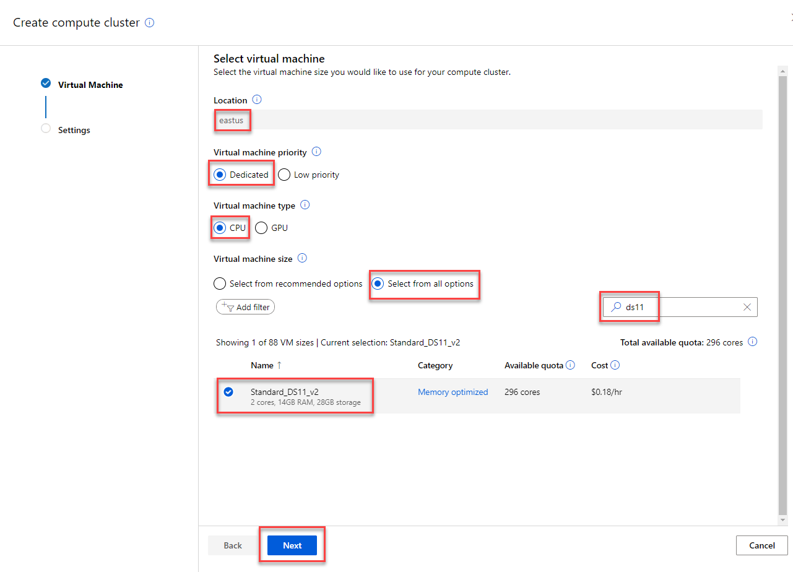
    
    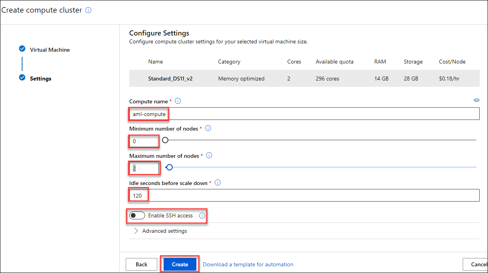

5. Click on **Create**.

## Create a dataset

Now that you have some compute resources that you can use to process data, you'll need a way to store and ingest the data to be processed.

1. On the LabVM browser open new tab and browse https://aka.ms/diabetes-data. Click **ctrl+s** to save this as a local file named **diabetes.csv** (it doesn't matter where you save it).

2. In Azure Machine Learning studio, view the **Datasets** page on the left panel. Datasets represent specific data files or tables that you plan to work with in Azure ML.

3. Create a new dataset from local files, using the following settings:

    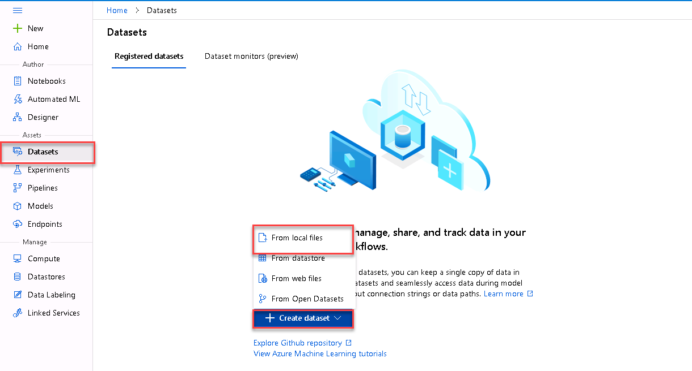
    
    * **Basic Info**:
        * **Name**: diabetes dataset
        * **Dataset type**: Tabular
        * **Description**: Diabetes data
        
    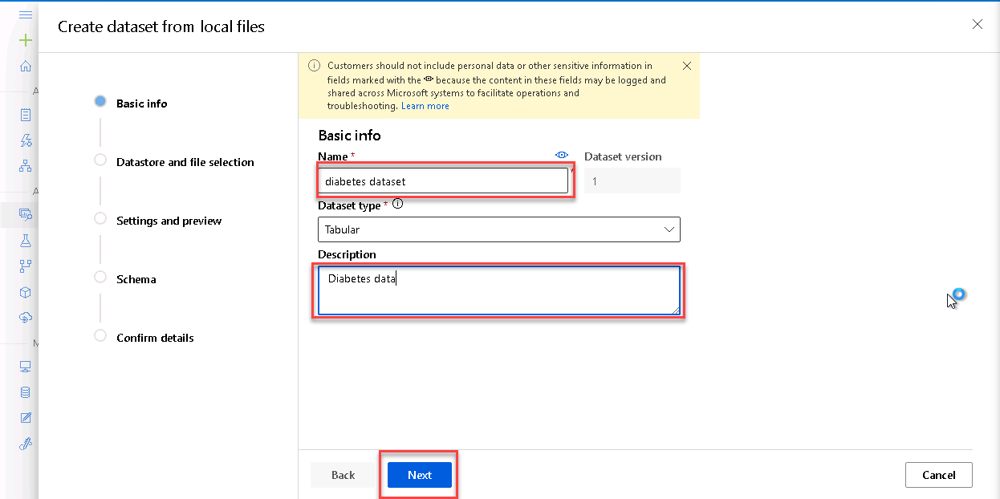
    
    * **Datastore and file selection**:
        * **Select or create a datastore**: Currently selected datastore
        * **Select files for your dataset**: click on upload and Browse to the **diabetes.csv** file you downloaded.
        * **Upload path**: *Leave the default selection*
        * **Skip data validation**: Not selected
        
    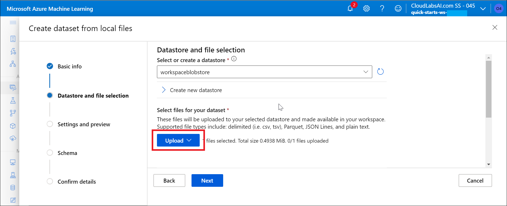  
    
    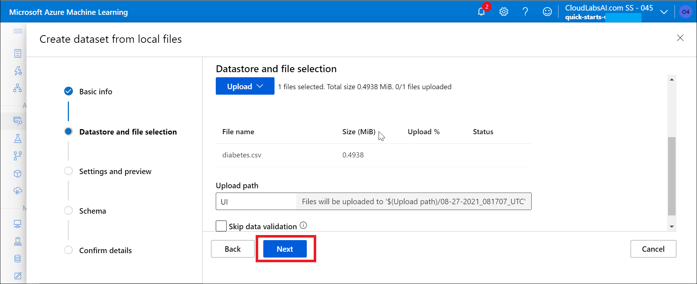
    
    * **Settings and preview**:
        * **File format**: Delimited
        * **Delimiter**: Comma
        * **Encoding**: UTF-8
        * **Column headers**: only first file has headers
        * **Skip rows**: None
        
    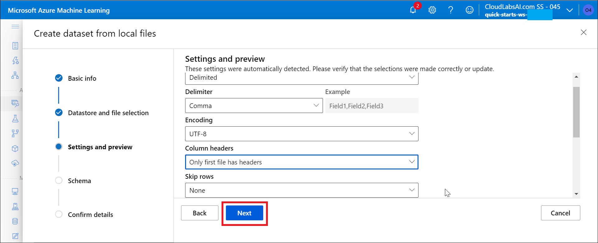
    
    * **Schema**:
        * Include all columns other than **Path**
        * Review the automatically detected types
    * **Confirm details**:
        * Do not profile the dataset after creation
        
    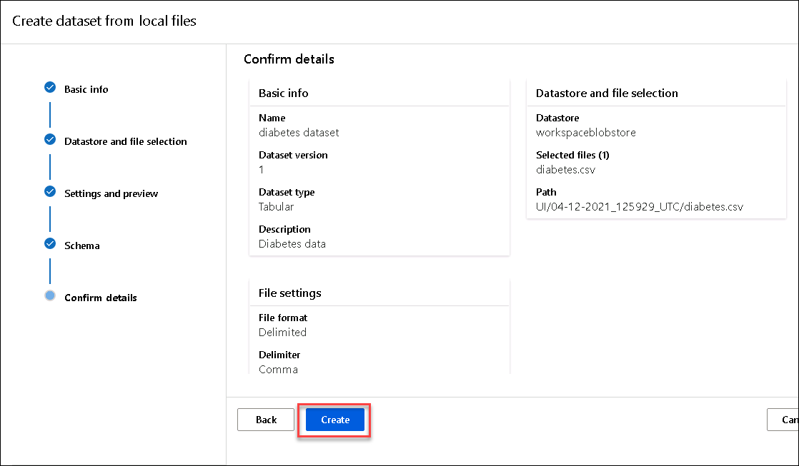

4. After the dataset has been created, open it and view the **Explore** page to see a sample of the data. This data represents details from patients who have been tested for diabetes, and you will use it to train a model that predicts the likelihood of a patient testing positive for diabetes based on clinical measurements.

4. After the dataset has been created, open it and view the **Explore** page to see a sample of the data. This data represents details from patients who have been tested for diabetes, and you will use it to train a model that predicts the likelihood of a patient testing positive for diabetes based on clinical measurements.

    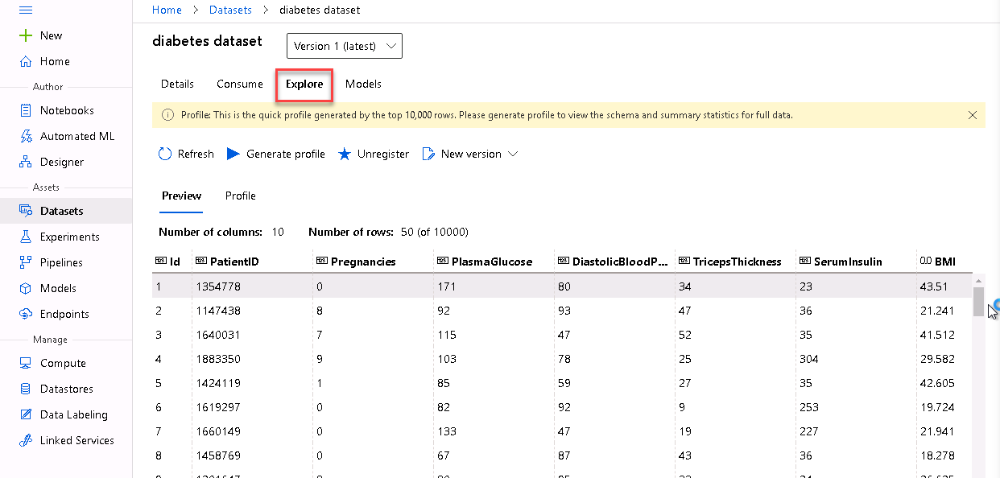
    
    > **Note**: You can optionally generate a *profile* of the dataset to see more statistical details.

## Run an automated machine learning experiment

In Azure Machine Learning, operations that you run are called *experiments*. Follow the steps below to run an experiment that uses automated machine learning to train a classification model that predicts diabetes diagnoses.

1. In Azure Machine Learning studio, view the **Automated ML** page from the left panel under **Author**.

2. Create a new Automated ML run with the following settings:

   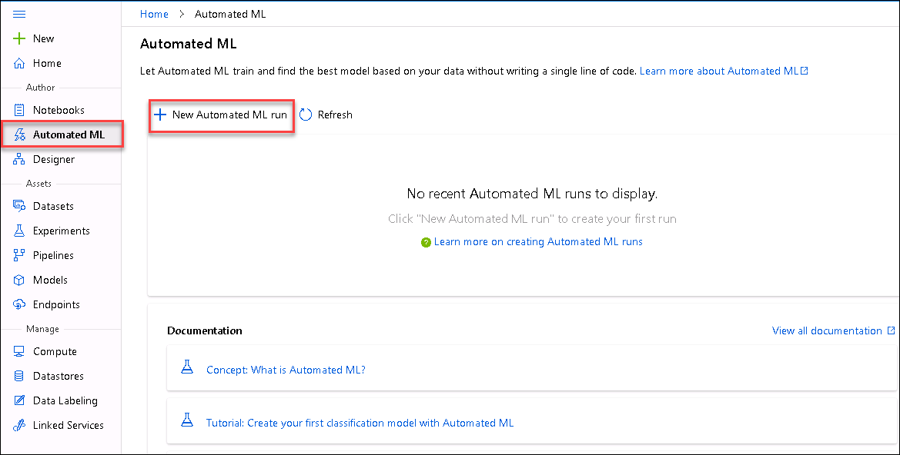

    - **Select dataset**:
        - **Dataset**: diabetes dataset
    - **Configure run**:
        - **New experiment name**: mslearn-automl-diabetes
        - **Target column**: Diabetic (*this is the label the model will be trained to predict)*
        - **Select compute cluster**: *the compute cluster you created previously*
        
    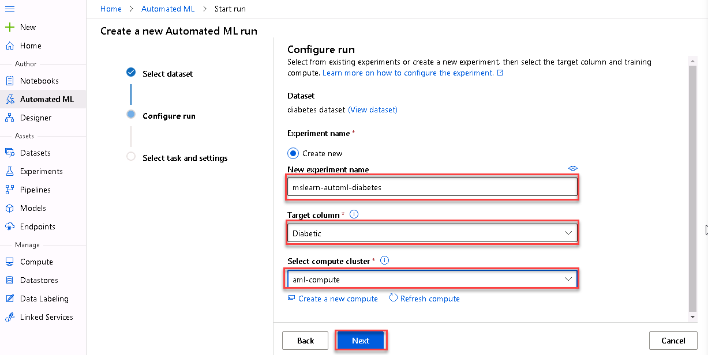
    
    - **Task type and settings**:
        - **Task type**: Classification
        - **Additional configuration settings:**
            - **Primary metric**: Select **AUC_Weighted** *(more about this metric later!)*
            - **Explain best model**: Selected - *this option causes automated machine learning to calculate feature importance for the best model; making it possible to determine the influence of each feature on the predicted label.*
            - **Blocked algorithms**: Leave all algorithms selected
            - **Exit criterion**:
                - **Training job time (hours)**: 0.5 - *this causes the experiment to end after a maximum of 30 minutes.*
                - **Metric score threshold**: 0.90 - *this causes the experiment to end if a model achieves a weighted AUC metric of 90% or higher.*

    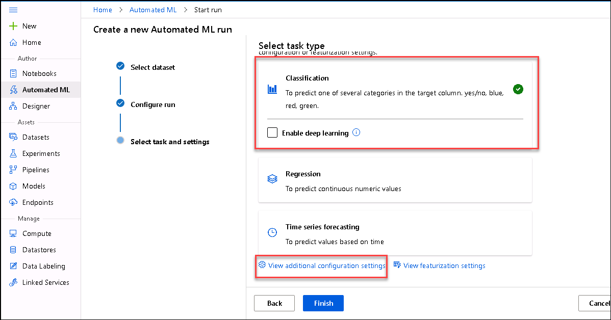
    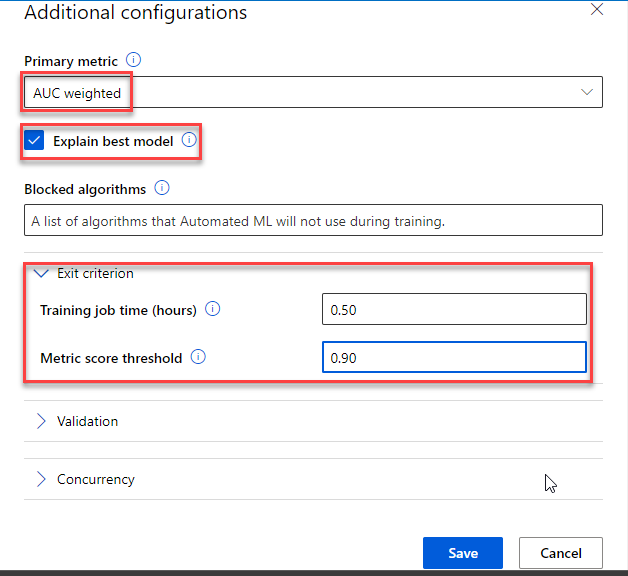

      - **Featurization settings:**
            - **Enable featurization**: Selected - *this causes Azure Machine Learning to automatically preprocess the features before training.*
   
    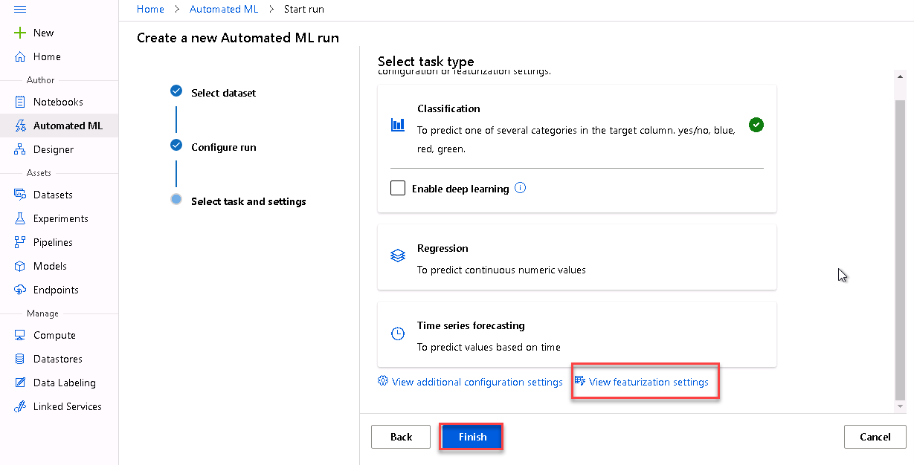
    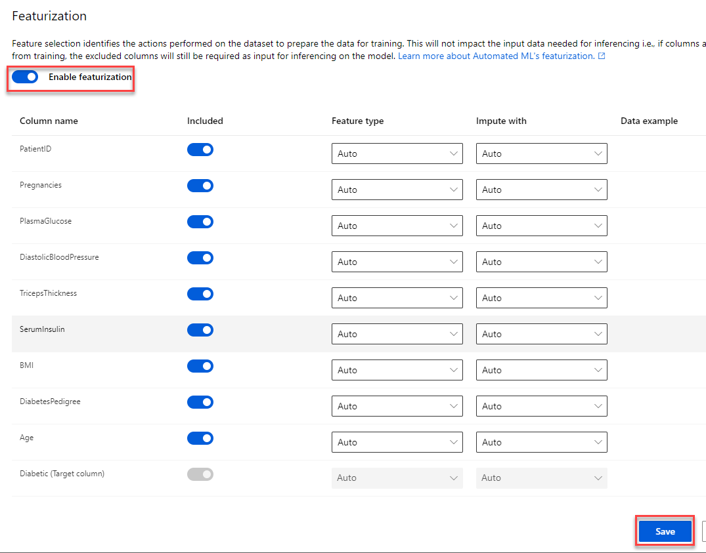
    
3. When you finish submitting the automated ML run details, it will start automatically. You can observe the status of the run in the **Properties** pane.

4. When the run status changes to *Running*, view the **Models** tab and observe as each possible combination of training algorithm and pre-processing steps is tried and the performance of the resulting model is evaluated. The page will automatically refresh periodically, but you can also select **&#8635; Refresh**. It may take ten minutes or so before models start to appear, as the cluster nodes need to be initialized and the data featurization process completed before training can begin. Now might be a good time for a coffee break!

5. Wait for the experiment to finish.

    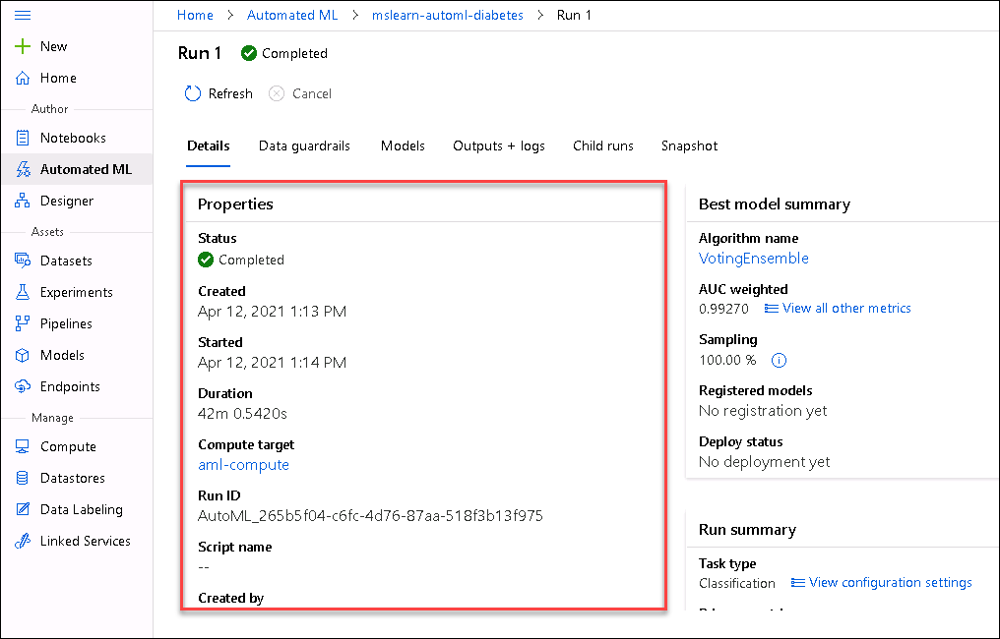
    
    
## Review the best model

After the experiment has finished; you can review the best performing model that was generated (note that in this case, we used exit criteria to stop the experiment - so the "best" model found by the experiment may not be the best possible model, just the best one found within the time and metric constraints allowed for this exercise!).

1. On the **Details** tab of the automated machine learning run, note the best model summary.

2. Select the **Algorithm name** for the best model to view the child-run that produced it.

 - The best model is identified based on the evaluation metric you specified (*AUC_Weighted*). To calculate this metric, the training process used some of the data to train the model, and applied a technique called *cross-validation* to iteratively test the trained model with data it wasn't trained with and compare the predicted value with the actual known value. 
 - From these comparisons, a *confusion matrix* of true-positives, false-positives,true-negatives, and false-negatives is tabulated and additional classification metrics calculated - including a Receiving Operator Curve (ROC) chart that compares the True-Positive rate and False-Positive rate. The area under this curve (AUC) us a common metric used to evaluate classification performance.

    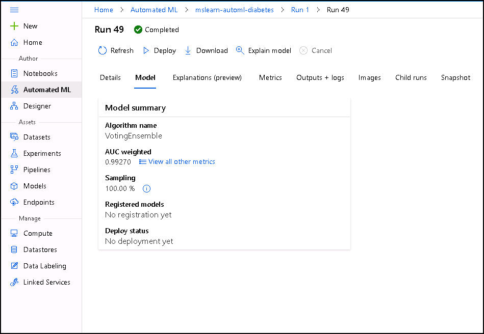

3. Next to the *AUC_Weighted* value, select **View all other metrics** to see values of other possible evaluation metrics for a classification model.

4. Select the **Metrics** tab and review the performance metrics you can view for the model. These include a **confusion_matrix** visualization showing the confusion matrix for the validated model, and an **accuracy_table** visualization that includes the ROC chart.

    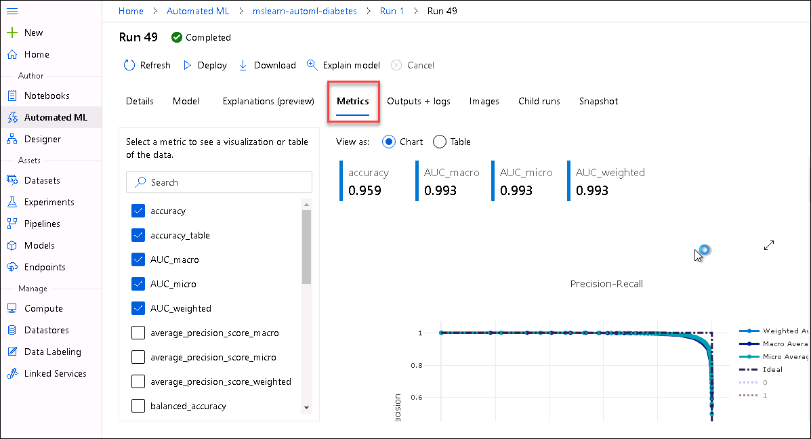

5. Select the **Explanations** tab, and view the **Global Importance** chart. This shows the extent to which each feature in the dataset influences the label prediction.

## Deploy a predictive service

After you've used automated machine learning to train some models, you can deploy the best performing model as a service for client applications to use.

 - In Azure Machine Learning, you can deploy a service as an Azure Container Instances (ACI) or to an Azure Kubernetes Service (AKS) cluster. For production scenarios, an AKS deployment is recommended, for which you must create an *inference cluster* compute target. 
 - In this exercise, you'll use an ACI service, which is a suitable deployment target for testing, and does not require you to create an inference cluster.

1. Select the **Details** tab for the run that produced the best model.

2. Use the **Deploy** button to deploy the model with the following settings:
    - **Name**: auto-predict-diabetes
    - **Description**: Predict diabetes
    - **Compute type**: Azure Container Instance
    - **Enable authentication**: Selected

    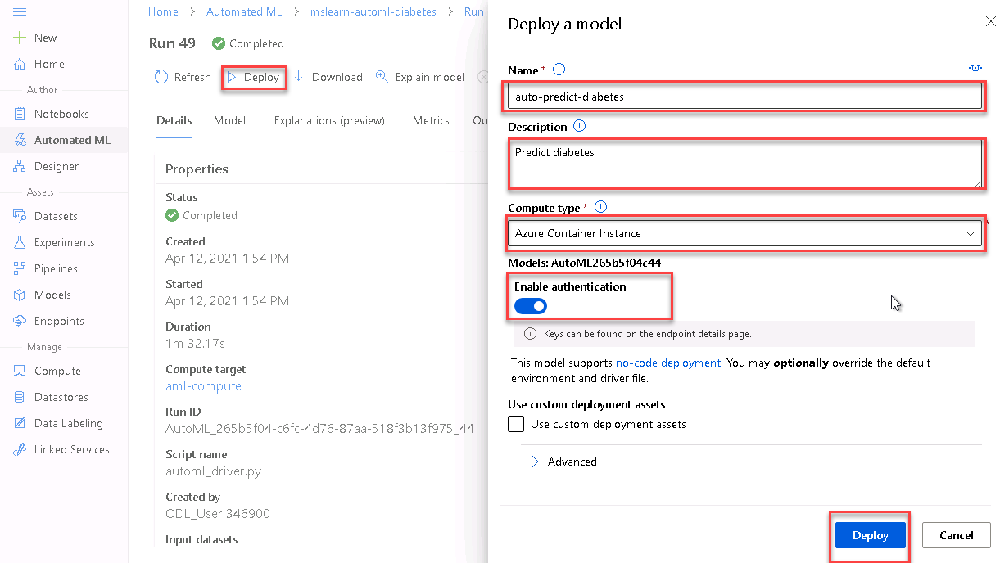

3. Wait for the deployment to start - this may take a few seconds. Then, on the **Model** tab, in the **Model summary** section, observe the **Deploy status** for the **auto-predict-diabetes** service, which should be **Running**. Wait for this status to change to **Successful**. You may need to select **&#8635; Refresh** periodically.

    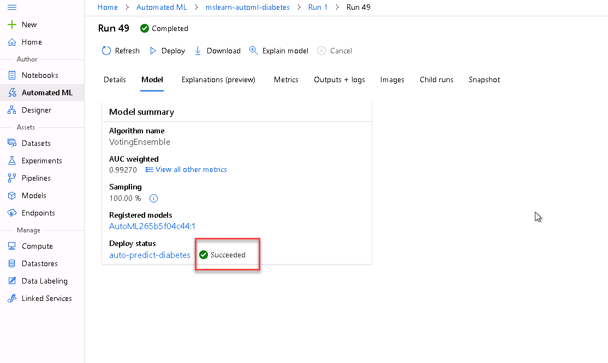

4. In Azure Machine Learning studio, view the **Endpoints** page and select the **auto-predict-diabetes** real-time endpoint. Then select the **Consume** tab and note the following information there. You need this information to connect to your deployed service from a client application.
    - The REST endpoint for your service
    - the Primary Key for your service

    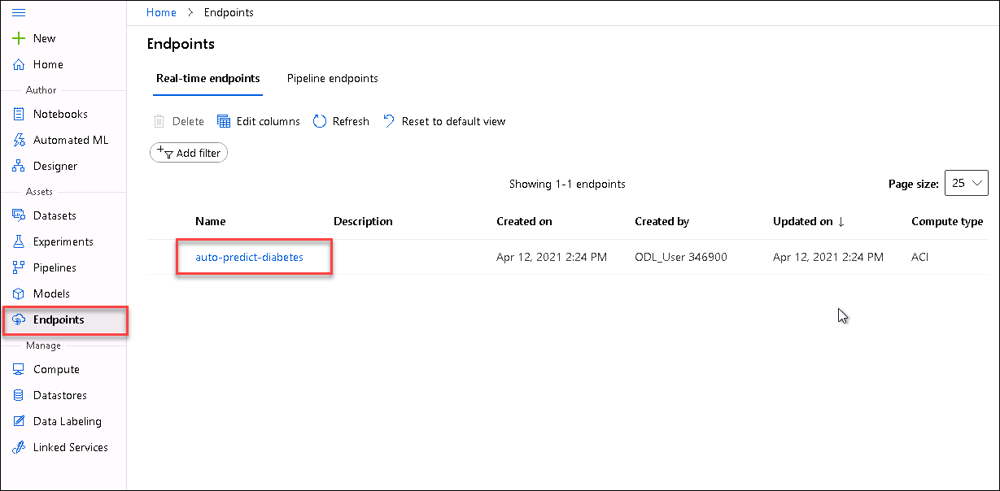
    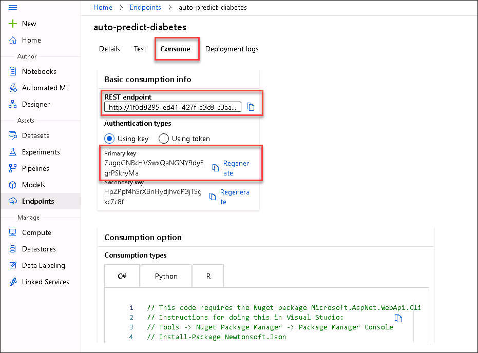

5. Note that you can use the &#10697; link next to these values to copy them to the clipboard.

## Test the deployed service

Now that you've deployed a service, you can test it using some simple code.

1. With the **Consume** page for the **auto-predict-diabetes** service page opened in your browser, Duplicate the page in the New tab of Azure Machine Learning studio. Then in the new tab , view the **Notebooks** page.

2. In the **Notebooks** page, under **My files**, browse to the **Users/mslearn-dp100** folder where you cloned the notebook repository, and open the **Get AutoML Prediction** notebook.

3. When the notebook has opened, ensure that the compute instance **Notebook-{DeploymentID}** is selected in the **Compute** box, and that it has a status of **Running**.

4. In the notebook, replace the **ENDPOINT** and **PRIMARY_KEY** placeholders with the values for your service, which you can copy from the **Consume** tab on the page for your endpoint.

5. Run the code cell and view the output returned by your web service.

    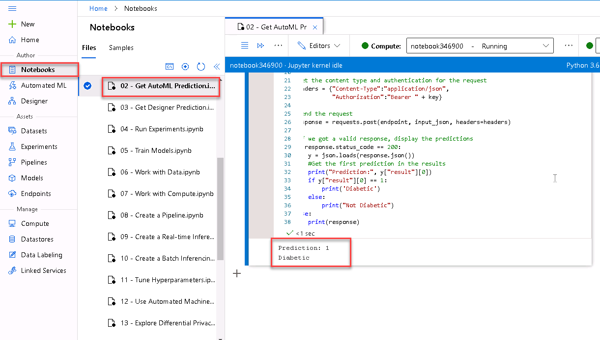
