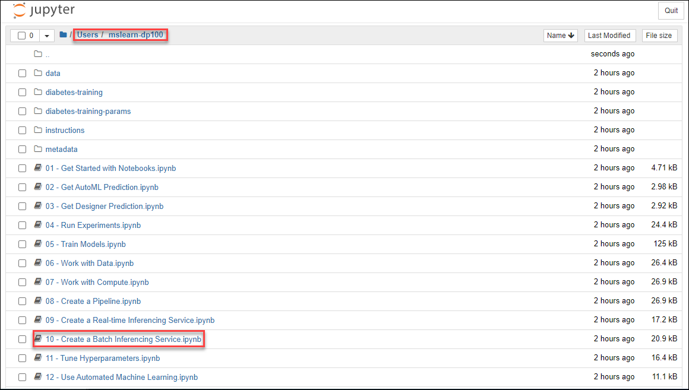

# Create a Batch Inferencing Service

In many scenarios, inferencing is performed as a batch process that uses a predictive model to score a large number of cases. To implement this kind of inferencing solution in Azure Machine Learning, you can create a batch inferencing pipeline.
## Open Jupyter

While you can use the **Notebooks** page in Azure Machine Learning studio to run notebooks, it's often more productive to use a more fully-featured notebook development environment like *Jupyter*.

> **Tip**: Jupyter Notebook is a commonly used open source tool for data science. You can refer to the [documentation](https://jupyter-notebook.readthedocs.io/en/stable/notebook.html) if you are unfamiliar with it.

1. In the LabVM browser open Azure Machine Learning studio(https://ml.azure.com), view the **Compute** page for your workspace; and on the **Compute Instances** tab, start your compute instance if it is not already running.

    **Note**: If you get **Welcome to the studio** page when you login, Select **Subscription** and **Machine Learning workspace** available in the drop down then click on **Get Started**.

2. When the compute instance is running, click the **Jupyter** link to open the Jupyter home page in a new browser tab. Be sure to open *Jupyter* and not *JupyterLab*.

    

## Create a batch inferencing service

In this exercise, the code to deploy a model as a batch inferencing service is provided in a notebook.

1. In the Jupyter home page, browse to the **Users/mslearn-dp100** or **Users/*{Username}*/mslearn-dp100** folder where you cloned the notebook repository, and open the **Create a Batch Inferencing Service** (10 - Create a Batch Inferencing Service.ipynb) notebook.

    

2. Then read the notes in the notebook, running each code cell in turn.
3. When you have finished running the code in the notebook, on the **File** menu, click **Close and Halt** to close it and shut down its Python kernel. Then close all Jupyter browser tabs.

