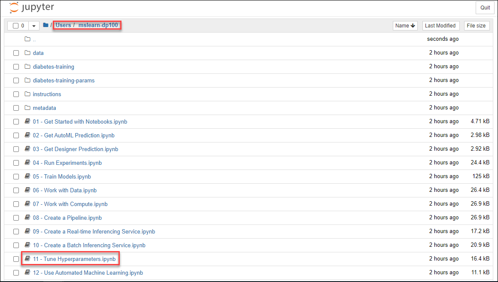

# Tune Hyperparameters

## Overview

Hyperparameters are variables that affect how a model is trained, but which can't be derived from the training data. Choosing the optimal hyperparameter values for model training can be difficult, and usually involved a great deal of trial and error.

In this exercise, you'll use Azure Machine Learning to tune hyperparameters by performing multiple training runs in parallel.

## Open Jupyter

While you can use the **Notebooks** page in Azure Machine Learning studio to run notebooks, it's often more productive to use a more fully-featured notebook development environment like *Jupyter*.

> **Tip**: Jupyter Notebook is a commonly used open-source tool for data science. You can refer to the [documentation](https://jupyter-notebook.readthedocs.io/en/stable/notebook.html) if you are unfamiliar with it.

1. In the LabVM browser open Azure Machine Learning Studio(https://ml.azure.com). If prompted, login using the credentials provided in the **Environment Details** tab. View the **Compute** page for your workspace.

    **Note**: If you get **Welcome to the studio** page when you login, Select **Subscription** and **Machine Learning workspace** available in the drop down then click on **Get Started**.

2. On the **Compute Instances** tab, start your compute instance if it is not already running.

3. When the compute instance is running, click the **Jupyter** link to open the Jupyter home page in a new browser tab. Be sure to open *Jupyter* and not *JupyterLab*.

    

## Run a hyperparameter tuning experiment

In this exercise, the code to run a hyperparameter tuning experiment is provided in a notebook.

1. In the Jupyter home page, browse to the **Users/mslearn-dp100** or **Users/*{Username}*/mslearn-dp100** folder where you cloned the notebook repository.

2. Click on **Tune Hyperparameters** (11 - Tune Hyperparameters.ipynb) notebook to open in the new tab.

    

3. Then read the notes in the notebook, running each code cell in turn. To run each cell select and click on **Run** on the menu.

4. When you have finished running the code in the notebook, on the **File** menu, click **Close and Halt** to close it and shut down its Python kernel. Then close all Jupyter browser tabs.

