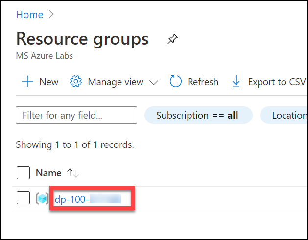
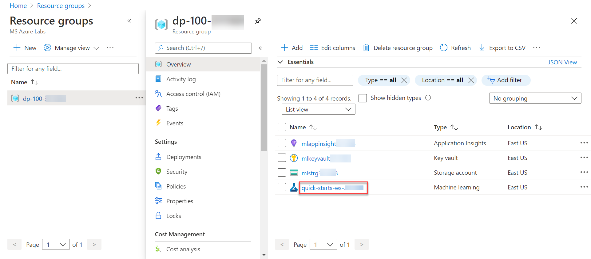
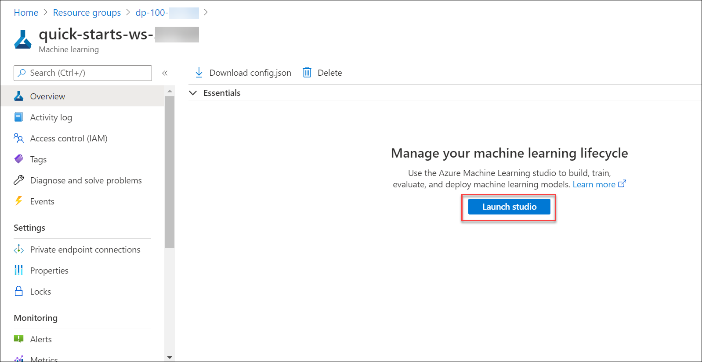
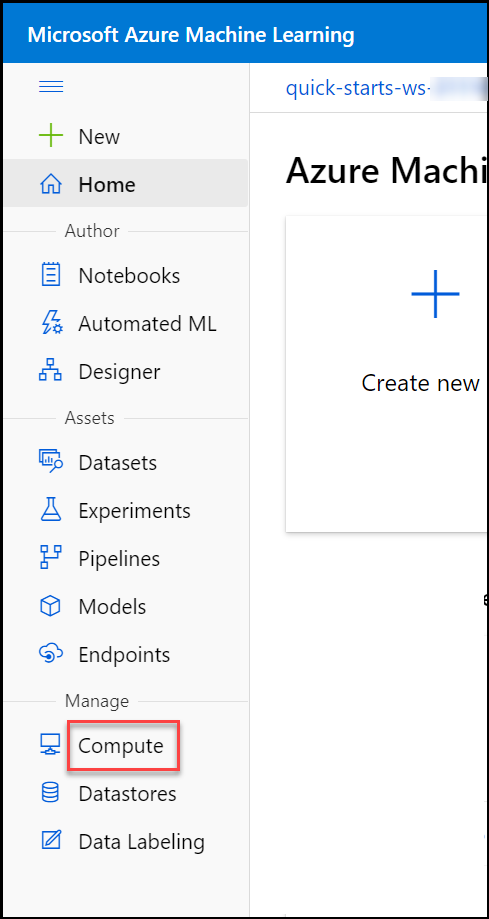
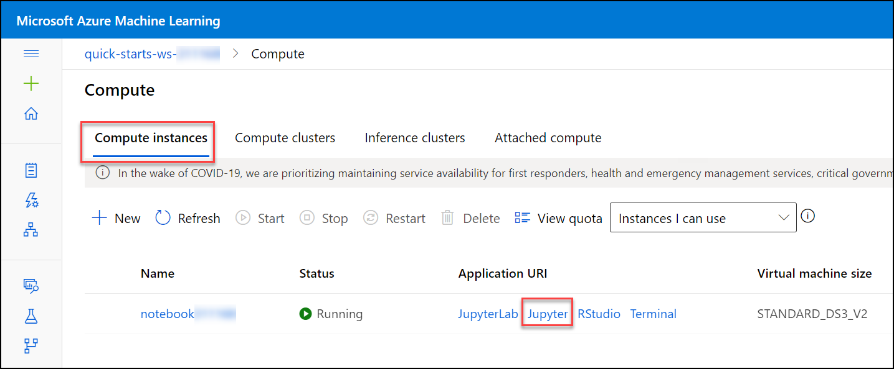
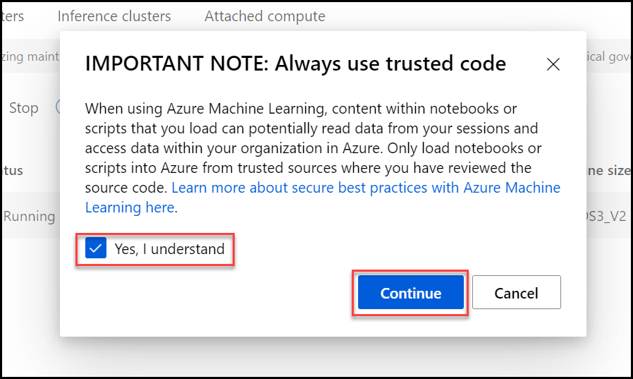
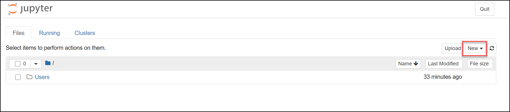
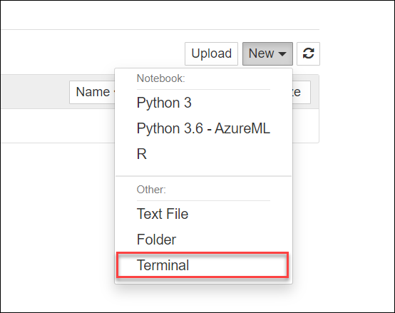
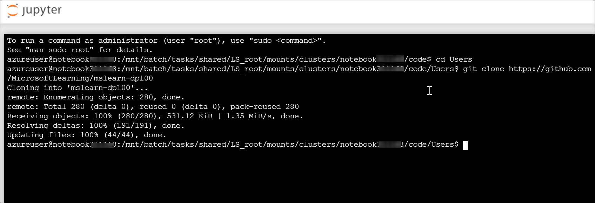

# Clone the repo to perform the lab

1. After signed into azure portal using the credentials given, Search for **Resource Groups** in the search bar or click on **Resource Groups** that you see in the homepage.

1. Then you will find the **dp-100-xxxxxx**, where xxxxxx is the deployment id of the lab. Click on **dp-100-xxxxxx** to find the resources for the lab.

    

1. Find the machine learning workspace named **quick-start-ws-xxxxxx**.

    
    
1. Click on **Launch Studio** to open the machine learning studio. Close the pop-up that appears.

    
    
1. Find **compute** from the Left navigation pane.

    
    
1. Under **compute instances** you can find **notebookxxxxxx**. Click on **Jupyter** to run the notebook to perform the lab. A lot of data science and machine learning experimentation is performed by running code in *notebooks*. Your compute instance includes fully featured Python notebook environments (*Jupyter* and *JuypyterLab*) that you can use for extensive work; but for basic notebook editing, you can use the built-in **Notebooks** page in Azure Machine learning studio.

    
    
1. A pop-up appears, Tick **Yes, I Understand** and click on **Continue**.

    
    
1. The Jupyter will open in a new window, Click on **New** to open the terminal.

    
    
    

1. Terminal will open in a new window, Enter the following commands to clone a Git repository containing notebooks, data, and other files to your workspace:

    ```bash
    cd Users
    git clone https://github.com/MicrosoftLearning/mslearn-dp100
    ```

1. Once completed running the commands it should look like the below image. Then close the terminal window and go back to the jupyter window.

    

1. Click **&#8635;** to refresh the view and verify that a new **Users/mslearn-dp100** folder has been created. This folder contains multiple **.ipynb** notebook files.

  > **Tip**: To run a code cell, select the cell you want to run and then use the **&#9655;** button to run it.


